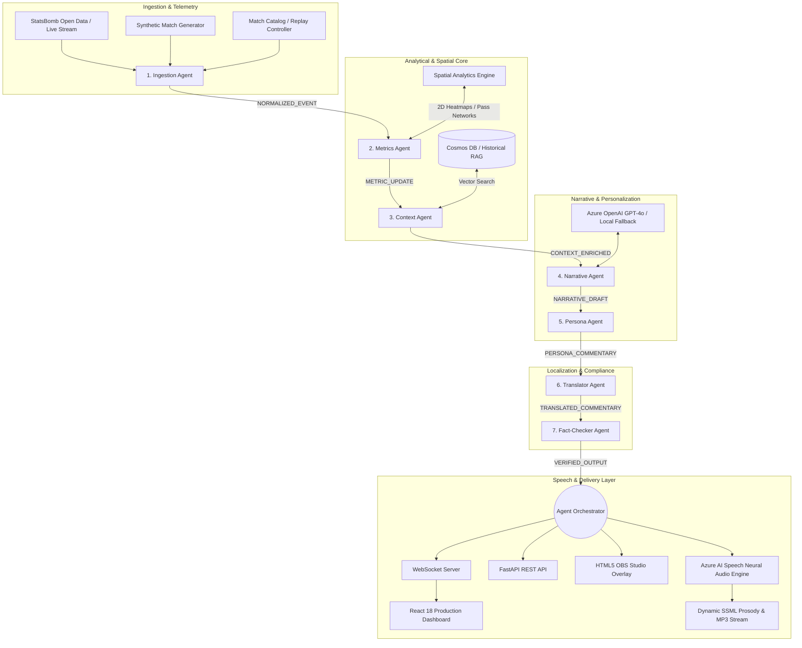

# ⚽ MatchMind: Multi-Agent Explainable Premier League Intelligence Platform

[](https://python.org)
[](https://react.dev)
[](https://azure.microsoft.com/en-us/products/ai-services/openai-service)
[](https://azure.microsoft.com/en-us/products/ai-services/speech-services)
[](https://docker.com)
[](https://pytest.org)
[](https://opensource.org/licenses/MIT)

> **Submitted to:** Microsoft Premier League Hackathon — *"Inside the Game"*  
> **Target Category:** Grand Prize (1st Place) + Best Multi-Agent System Prize  
> **Documentation:** [Architecture](docs/ARCHITECTURE.md) | [Agent Specs](docs/AGENT_SPECS.md) | [Judging Criteria Mapping](docs/JUDGING_CRITERIA_MAPPING.md) | [2-Min Demo Script](docs/DEMO_SCRIPT.md)

---

## 🌟 Executive Summary

Every weekend, **1.87 billion Premier League fans** watch matches across 190 countries. But while elite clubs invest millions in proprietary data systems, broadcasters and fans are left with raw box scores and generic commentary.

**MatchMind** transforms raw, high-frequency match events into **explainable tactical intelligence, neural audio commentary, spatial visualizations, and personalized storytelling in real time**. Rather than just reciting **WHAT** happened, MatchMind's multi-agent cluster explains **WHY it matters**.

---

## 🏛️ System Architecture: The 7 Specialized Micro-Agents

MatchMind implements an asynchronous, distributed event bus coordinating 7 specialized micro-agents with microsecond execution latencies:



---

## ⚡ Core Feature Highlights

### 1. 🎙️ Azure AI Speech Neural Audio & Dynamic SSML (Phase A)
- **Neural Voice Selection Matrix**: Dedicated voices across 6 languages: `en-GB-AlfieNeural` (Casual), `en-GB-RyanNeural` (Tactical), `es-ES-AlvaroNeural`, `hi-IN-MadhurNeural`, `ar-SA-HamedNeural`, `fr-FR-HenriNeural`, `pt-BR-AntonioNeural`.
- **Dynamic Prosody Inflection**: Automatic pitch (`+18%`), rate (`+16%`), and `<mstts:express-as style="excited">` inflection during goals and high-leverage turning points.
- **SSML Inspector Modal**: One-click inspection of generated Azure Cognitive Services XML markup.

### 2. ⚽ Historical Match Catalog & Timeline Scrubber (Phase B)
- **4 Full Fixtures**: Arsenal vs Liverpool 2024, Man City vs Chelsea 2024, Tottenham vs Newcastle 2024, and Argentina vs France (StatsBomb 4,407 events).
- **Interactive Scrubber (0' to 95')**: Play, Pause, Speed (`1x`, `2x`, `5x`), Step, and instant Highlight Pins (⚽ Goals, 🟥 Red Cards, ⚡ Big Chances).
- **Match Selector Dropdown**: Instantly switch between Premier League fixtures in the header.

### 3. 🗺️ Tactical Spatial Intelligence Overlays (Phase C)
- **🔥 2D Gaussian Smoothed Heatmap**: Discretized $24 \times 16$ tactical density grid ($5\text{m} \times 5\text{m}$ cells) with team or individual player filtering (e.g. Bukayo Saka).
- **🕸️ Pass Network Topology**: Real-time passing lines with player centroid nodes $(\bar{X}, \bar{Y})$, jersey numbers, and pass volume weights.
- **🛡️ Defensive Pressing Zones**: Pitch thirds breakdown (High Press, Mid Block, Low Block) with recovery coordinates and High-Press Share percentage ($37.3\%$).

### 4. 🐳 Docker Containerization & Azure Bicep IaC (Phase D)
- **Multi-Stage Dockerfile**: Builds optimized React 18 SPA + Python 3.11 slim runtime.
- **Single-Container Full-Stack Mode**: Serves the React frontend directly from FastAPI on port 8000 when accessed by browsers, while providing all REST APIs and WebSockets.
- **Azure Bicep Templates**: Production IaC (`main.bicep`) configuring Container Apps, Azure OpenAI, Azure AI Speech, and Cosmos DB with one-click deployment (`deploy.ps1` / `deploy.sh`).

---

## 🚀 Quick Start (Local Setup)

### Option A: Local Development (Fastest)

```bash
# 1. Clone & enter directory
git clone https://github.com/YOUR_USERNAME/matchmind.git
cd matchmind

# 2. Setup Python environment
python -m venv .venv
.\.venv\Scripts\pip install -r requirements.txt

# 3. Start Backend API & WebSocket Server
.\.venv\Scripts\python -m uvicorn matchmind.delivery.rest_api:app --reload --port 8000

# 4. In a second terminal, start React Dashboard
cd frontend
npm install
npm run dev
```

* **Frontend Dashboard:** [http://localhost:5173/](http://localhost:5173/)
* **Backend API Docs:** [http://localhost:8000/docs](http://localhost:8000/docs)
* **OBS Broadcast Overlay:** [http://localhost:8000/overlay](http://localhost:8000/overlay)

---

### Option B: Docker Container

```bash
# Build and run the unified single-container production image
docker compose up --build
```
Open [http://localhost:8000/](http://localhost:8000/) — the unified container serves the React frontend, REST endpoints, and WebSockets on port 8000!

---

## 🧪 Automated Verification Suite

Run the full end-to-end integration test suite:
```bash
.\.venv\Scripts\pytest tests/ -v
```
Run the automated deployment verification test:
```bash
.\.venv\Scripts\python scripts/verify_deployment.py
```

---

## 📄 License
This project is licensed under the MIT License.
