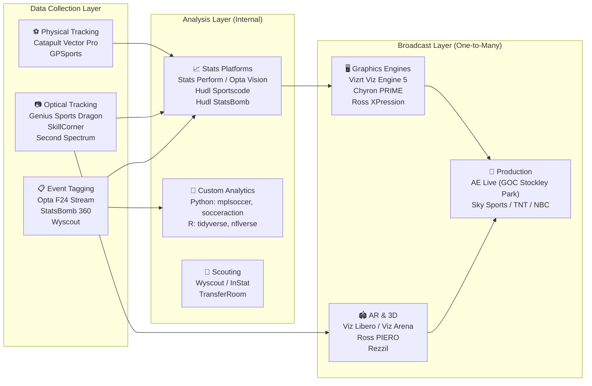
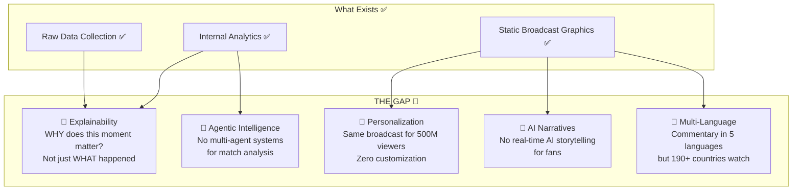
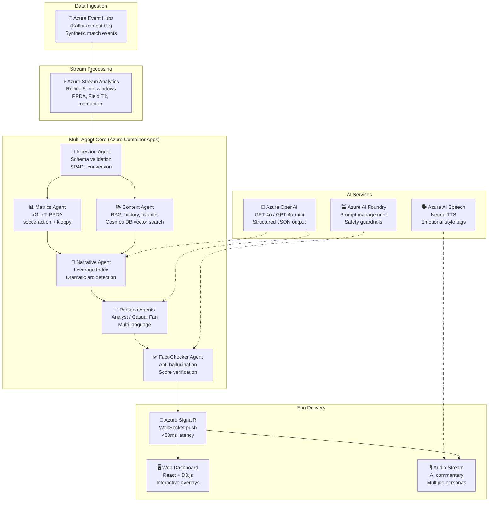
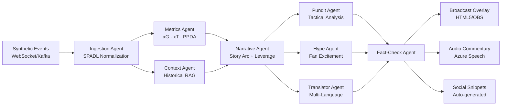

# 🔬 Deep Research & Strategic Analysis: Microsoft Premier League Hackathon
## "Inside the Game" — What to Build and Why

> **Purpose:** Market research, technology landscape analysis, gap identification, and concrete project ideas for the Microsoft × Premier League Hackathon (Oct 6–27, 2026)

---

## 📊 Part 1: The Sports-Tech Landscape — What Already Exists

### The Current Stack (B2B/Internal — NOT What This Hackathon Wants)



### Key Existing Players & What They Do

| Layer | Company/Tool | What It Does | Who Uses It |
|---|---|---|---|
| **Tracking** | Catapult Vector Pro | GPS vests with accelerometers for biometric data | Team staff only |
| **Tracking** | Genius Sports "Dragon" | 28+ cameras, 10,000 mesh points/player at 200fps, 3D skeletal models | Premier League VAR |
| **Events** | Opta (Stats Perform) | F24 XML/JSON stream: every touch, pass, shot with coordinates + xG/xA | Broadcasters, clubs |
| **Events** | StatsBomb 360 | Freeze-frame of all 22 player positions at every event | Analysts, clubs |
| **Graphics** | Vizrt + AE Live | Lower-thirds, scorebugs, xG overlays for Sky/TNT | Broadcasters |
| **Graphics** | Chyron PRIME | NBC Sports studio graphics, telestration | NBC |
| **Video AI** | WSC Sports (Large Sports Model) | Auto-clipped highlights, smart recaps, vertical reformatting | Leagues, media |
| **Scouting** | Wyscout / InStat | Player profiles, video clips for recruitment | Clubs, agents |

### Advanced Metrics Already in Production

| Metric | What It Measures | Formula/Method |
|---|---|---|
| **xG** (Expected Goals) | Shot scoring probability | Logistic regression on distance, angle, body part, context, freeze-frame |
| **PSxG** (Post-Shot xG) | Shot quality after ball is struck | Adds target coordinates, speed, trajectory |
| **xT** (Expected Threat) | Value of ball progression | Markov Decision Process on pitch grid: $xT_z = (s_z \times g_z) + m_z \times \sum T_{z \to z'} \times xT_{z'}$ |
| **PPDA** | Pressing intensity | Opposition passes allowed / defensive actions in pressing zone |
| **VAEP** | Value of any action | $V(a_i) = \Delta P_{scores} - \Delta P_{concedes}$ |
| **Field Tilt** | Territorial dominance | Team final-third passes / (Team + Opponent final-third passes) |

### Fan-Facing AI Tools That Already Exist (What Fans Actually Touch)

| Tool | Provider | What Fans Experience |
|---|---|---|
| **Premier League Companion** | Microsoft Copilot + Azure OpenAI | Natural-language Q&A across 30+ seasons of PL data, FPL AI Manager |
| **Bundesliga "Coach Mode"** | DFL + AWS | AI explains tactical nuances (half-space overloads, counter-pressing) to casual viewers |
| **Prime Video X-Ray** | Amazon | Toggle real-time speed, heatmaps, win probability, fantasy stats while watching |
| **SofaScore Attack Momentum** | SofaScore | Live ML-driven player ratings + dominance curve updated every minute |
| **Immersiv.io ARISE** | Immersiv.io | AR overlays via smartphone camera at stadiums; Apple Vision Pro 3D pitch at home |
| **BetVision** | Genius Sports | Live odds, micro-betting widgets, bet-tracking integrated into video player |
| **LiveLike "Genie"** | LiveLike | Auto-generates engagement widgets (polls, reactions) from match events |

### Broadcast Graphics Stack (How PL Overlays Actually Work)

```
[Pitch-side Tracking]          [Data Integration]          [Render Engine]           [Distribution]
Genius Sports Dragon  ──────►  AE Live Middleware  ──────►  Vizrt Viz Engine 5  ──────►  Sky/TNT/NBC
(28 cameras, 200fps,           (Stockley Park GOC)          (+ Unreal Engine 5)          (SMPTE ST 2110)
10K mesh pts/player)           Opta F24 JSON stream          Chyron PRIME (NBC)           OTT feeds
```

### 📈 Market Size — The Opportunity Is Massive

| Market Segment | Value (2024–25) | Projected Value | CAGR | Source |
|---|---|---|---|---|
| **Sports Analytics** | \$5.70B | \$23.10B (2033) | 18.5% | Grand View Research |
| **AI in Sports** | \$1.03B | \$2.61B (2030) | 16.7% | MarketsandMarkets |
| **AI in Media & Broadcasting** | \$8.21B | **\$51.08B (2030)** | **35.6%** | MarketsandMarkets |
| **Fan Engagement Platforms** | \$5.90B | \$25.40B (2034) | 16.3% | Global Market Insights |
| **AI Fan Engagement** | \$1.20B | \$5.90B (2033) | 22.0% | Future Data Stats |
| **Total Fan Engagement Tech** | \$16.20B | **\$66.70B (2034)** | 15.2% | Market.us |

> The **AI in Media & Broadcasting** segment alone is growing at **35.6% CAGR** — the fastest-growing segment in all of sports tech. This is exactly where the hackathon sits.

---

## 🎯 Part 2: The GAP — Why This Hackathon Is Different

### The Critical Insight

> **Everything above is B2B infrastructure. This hackathon wants the B2C intelligence layer.**

The existing ecosystem has a massive blind spot:



### The 5 Market Gaps This Hackathon Targets

| # | Gap | What Exists Today | What's Missing |
|---|---|---|---|
| 1 | **Explainability** | xG = 0.85 shown on screen as a number | No explanation of "because the defender was 6.2m out of position, creating a shooting lane that opens once per 8 matches" |
| 2 | **Fan Personalization** | Everyone sees the exact same broadcast overlay | No way for a casual fan to see "Haaland mode" or an analyst to see "pressing intensity dashboard" |
| 3 | **AI-Native Narratives** | Human commentators + basic auto-generated text tickers | No LLM-powered real-time storytelling that adapts tone, depth, and perspective |
| 4 | **Multi-Language at Scale** | Commentary in ~5 languages, text in ~10 | 190+ countries watch PL; need real-time AI narratives in 40+ languages |
| 5 | **Agentic Architecture** | Monolithic analytics pipelines | No orchestrated multi-agent system where specialized agents collaborate |
| 6 | **Partisan Fan Allegiance** | AI commentary is sterile & neutral | Fans want bias aligned with their club culture (Arsenal view vs. Spurs view of a North London Derby) |

### ⚠️ Critical Lessons: What NOT to Do (Industry Failures)

> [!CAUTION]
> **The Gannett/LedeAI Disaster (2023):** Gannett deployed AI to auto-write high school sports recaps. It produced bizarre phrases like *"a scoreboard in hibernation"* and printed raw template tags like `[[WINNING_TEAM_MASCOT]]`. Project was halted nationwide.
>
> **The Sports Illustrated Scandal (2023):** AI-generated articles published under fake author profiles with AI-generated headshots. Led to union revolts and contract terminations.
>
> **Lesson for us:** The Fact-Checker Agent is non-negotiable. Every AI-generated claim must be verified against raw telemetry. Zero hallucinations on scores, cards, or player identities.

### Confirmed Premier League × Microsoft Partnership (July 2025)

> [!IMPORTANT]
> Microsoft became the **Official Cloud and AI Partner** of the Premier League in a 5-year deal (2025/26 onward). They've already built:
> - **Premier League Companion** — conversational AI for fans (Copilot + Azure OpenAI + Foundry)
> - **FPL AI Assistant Manager** — predictive transfer recommendations
> - **Multilingual fan localization** — real-time translation
> 
> **This hackathon is Microsoft looking for the NEXT wave of innovations on top of this partnership.**

---

## 🏗️ Part 3: Reference Architecture — The Technical Blueprint

### Multi-Agent Sports Intelligence Pipeline



### Key Azure Services Mapping

| Service | Role in Pipeline | Why This One |
|---|---|---|
| **Azure Event Hubs** | Ingest synthetic match events | Kafka-compatible, ordered per-match partitions |
| **Azure Stream Analytics** | Compute rolling metrics on-stream | Windowed SQL queries, no custom code needed |
| **Azure Container Apps** | Host multi-agent system | Serverless, KEDA auto-scaling, stateful agents |
| **Azure OpenAI (GPT-4o)** | Generate narratives & explanations | Structured JSON output, fastest LLM inference |
| **Azure AI Foundry** | Orchestrate prompts & models | Multi-model catalog (Phi-4 for fast classification + GPT-4o for deep commentary) |
| **Azure Cosmos DB** | State store + vector search | Sub-10ms latency, built-in vector search for RAG |
| **Azure SignalR** | Push to fan clients | Millions of concurrent WebSocket connections |
| **Azure AI Speech** | Text-to-speech commentary | Emotional style tags (excited, tense, neutral) |

---

## 💡 Part 4: Project Ideas — What to Build

### 🏆 Idea 1: "MatchMind" — The Explainable AI Match Intelligence Platform
**Target Prize:** Grand Prize + Best Multi-Agent System

**Concept:** A multi-agent AI system that ingests synthetic match events in real-time and produces explainable, personalized match intelligence — not just "what happened" but "why it matters."

**Key Differentiators:**
```
┌─────────────────────────────────────────────────────────┐
│                    MATCHMIND AGENTS                      │
├─────────────────────────────────────────────────────────┤
│                                                          │
│  🔍 Tactical Analyst Agent                               │
│  "Liverpool's PPDA dropped from 7.2 to 14.8 in the      │
│   last 10 minutes — they've switched from Klopp-era      │
│   gegenpressing to a passive mid-block, likely due to     │
│   Henderson's fatigue (distance: 11.2km, sprint count     │
│   dropped 40% since minute 60)"                          │
│                                                          │
│  🎯 xG Explainer Agent                                   │
│  "Salah's shot had xG=0.72 because the center-back       │
│   was 6.2m out of position after being dragged by         │
│   Díaz's decoy run. This shooting angle opens only        │
│   once every 8 matches in PL data."                      │
│                                                          │
│  📊 Momentum Storyteller Agent                           │
│  "MOMENTUM SHIFT: After conceding, Arsenal have           │
│   completed 23 consecutive passes in Liverpool's          │
│   half (Field Tilt: 78%). This pressure pattern           │
│   historically leads to an equalizer within 12            │
│   minutes in 34% of similar PL sequences."               │
│                                                          │
│  🌍 Personalization Engine                               │
│  Casual Fan: "🔥 Salah just scored a BANGER!"            │
│  Analyst: "Salah goal: xG 0.72, PSxG 0.91, shot          │
│   speed 112km/h, 5 defenders bypassed (Packing: 5)"     │
│  Hindi: "सलाह ने शानदार गोल किया!"                       │
│                                                          │
│  ✅ Fact-Checker Agent                                   │
│  Validates every claim against raw telemetry.             │
│  Zero hallucinations on scores, cards, or identities.    │
│                                                          │
└─────────────────────────────────────────────────────────┘
```

**Deliverables:**
1. Real-time web dashboard with live pitch visualization
2. Multi-persona narrative feed (analyst / casual / multi-language)
3. Explainability panel: "Why This Moment Matters" for every key event
4. 2D tactical overlay suitable for broadcast integration
5. Demo video showing the system processing a full synthetic match

---

### 🥈 Idea 2: "FanLens" — Personalized Viewing Mode Engine
**Target Prize:** Grand Prize + Best Enterprise Solution

**Concept:** A platform that lets fans choose their "viewing mode" and receive customized real-time overlays, commentary, and narratives.

**Viewing Modes:**
| Mode | Target Audience | What They See |
|---|---|---|
| 🎮 **Casual Fan** | First-time viewers | Simple language, emoji reactions, "what just happened?" explanations |
| 📊 **Data Analyst** | Fantasy/betting fans | Live xG progression, passing networks, pressing maps |
| ⭐ **Player Focus** | Die-hard fans | "Follow Haaland" — every touch, run, positioning, heatmap |
| 🏟️ **Tactical View** | Coaches/pundits | Formation shifts, defensive line height, pressing triggers |
| 🌍 **My Language** | Global fans | Full AI narrative in their language with cultural adaptation |
| ♿ **Accessible** | Visually impaired | Audio descriptions, haptic rhythm for match tempo |

**Tech Stack:**
- Azure SignalR for real-time WebSocket delivery per viewing mode
- Azure OpenAI for mode-specific narrative generation
- React + D3.js for interactive overlay rendering
- User preference stored in Cosmos DB for cross-session personalization

---

### 🥉 Idea 3: "MatchCast AI" — Multi-Agent Broadcast Intelligence
**Target Prize:** Best Multi-Agent System + Best Azure Cloud Native

**Concept:** A production-ready multi-agent system that generates broadcast-quality match intelligence overlays in real-time, designed for integration with existing broadcast pipelines (OBS, CasparCG, or direct WebSocket).

**Agent Architecture:**



**Unique Value:** Demonstrates how specialized agents with distinct roles coordinate through shared state, handle failures gracefully, and deliver outcomes a single model could never achieve.

---

### 💎 Idea 4: "StoryBoard" — AI Match Recap & Narrative Studio
**Target Prize:** Best Use of Microsoft Foundry + Best Enterprise Solution

**Concept:** An Azure AI Foundry-powered platform that automatically generates multi-format match content:

| Output | Format | Use Case |
|---|---|---|
| **90-Second Recap** | Structured text + key moment timestamps | Social media / app push notification |
| **Studio Briefing** | Detailed tactical analysis document | Pre/post-match TV show prep |
| **Fan Newsletter** | Personalized email per fan's favorite team | Club CRM engagement |
| **Press Conference Prep** | Key talking points with stat backing | Manager/media officer |
| **Broadcast Lower-Thirds** | JSON-formatted overlay data | Graphics engine integration |

**Why Foundry:** Showcases prompt management, model catalog (fast Phi-4 for classification → deep GPT-4o for narratives), evaluation pipelines, and safety guardrails — exactly what the "Best Use of Foundry" prize asks for.

---

## 🎯 Part 5: Recommended Strategy

### Which Idea Should You Build?

> [!TIP]
> **My recommendation: Idea 1 ("MatchMind") as the primary entry, targeting Grand Prize + Best Multi-Agent System.**

**Reasoning:**
1. **Multi-Agent System** is the most technically impressive and hardest-to-replicate category — fewer teams will attempt it
2. **Explainability** is the biggest unsolved gap — every tool shows stats, nobody explains WHY
3. **Personalization** directly aligns with Premier League's stated goal of "flexible enough for fans in any market"
4. **Azure-native architecture** checks the Microsoft platform box
5. **Modular design** lets you demo multiple prize categories in one project

### Suggested Team Split (4 Members)

| Role | Responsibility |
|---|---|
| **Agent Architect** | Multi-agent orchestration (LangGraph/AutoGen on Azure Container Apps), Event Hub ingestion |
| **Metrics Engineer** | xG/xT/PPDA calculations (socceraction + kloppy), synthetic data simulation |
| **Narrative & AI Engineer** | Azure OpenAI prompt engineering, persona-based narratives, multi-language output |
| **Frontend & Demo Lead** | React dashboard, D3.js pitch visualizations, OBS overlay, demo video production |

### 4-Day Sprint Plan (Oct 6–10: First Sprint)

| Day | Milestone |
|---|---|
| **Day 1** | Set up Azure infrastructure (Event Hubs, Container Apps, OpenAI). Ingest StatsBomb open data as synthetic events. |
| **Day 2** | Build Ingestion Agent + Metrics Agent. Live xG/xT/PPDA computation working. |
| **Day 3** | Build Narrative Agent + Persona Agents. First AI-generated match commentary flowing. |
| **Day 4** | Build React dashboard with live pitch visualization. Connect SignalR WebSocket. |

---

## 📚 Part 6: Key Resources & Open Data

### Datasets to Use
| Dataset | What It Contains | URL |
|---|---|---|
| **StatsBomb Open Data** | Full match event streams (Champions League, World Cup, PL historic) | [github.com/statsbomb/open-data](https://github.com/statsbomb/open-data) |
| **Wyscout Open Data** | Full 2017/18 seasons across top 5 European leagues + World Cup (3M+ events) | [figshare.com/collections/Soccer_match_event_dataset](https://figshare.com/collections/Soccer_match_event_dataset/4415000) |
| **Metrica Sports** | Synchronized tracking + event data (25fps optical tracking) | [github.com/metrica-sports/sample-data](https://github.com/metrica-sports/sample-data) |
| **SkillCorner Open Data** | Broadcast tracking, speed, distance, pressing | [github.com/SkillCorner/opendata](https://github.com/SkillCorner/opendata) |

### Python Libraries
| Library | Use | Install |
|---|---|---|
| `statsbombpy` | Load StatsBomb open data | `pip install statsbombpy` |
| `socceraction` | SPADL conversion, xT, VAEP | `pip install socceraction` |
| `mplsoccer` | Pitch visualizations, shot maps | `pip install mplsoccer` |
| `kloppy` | Universal event data deserializer | `pip install kloppy` |
| `floodlight` | Spatio-temporal tracking analysis | `pip install floodlight` |

### Academic Papers to Reference
| Paper | Key Contribution |
|---|---|
| **TacticAI** (DeepMind + Liverpool, Nature Comms 2024) | GNN-based counterfactual tactical suggestions; preferred over human tactics 90% of the time |
| **SoccerAgent** (ACM MM 2025) | Multi-agent system for soccer understanding with SoccerWiki knowledge graph |
| **VAEP** (Decroos et al., KDD 2019) | Valuing all player actions, not just shots |
| **MatchTime** (EMNLP 2024) | Automatic commentary generation with temporal alignment |
| **GameSight** (arXiv 2025) | Knowledge-enhanced visual reasoning for pundit-grade commentary |

### Microsoft Learning Playlists
| Playlist | Link |
|---|---|
| GitHub Copilot | [aka.ms/asn/ghcopilot](https://aka.ms/asn/ghcopilot) |
| Azure AI Foundry | [aka.ms/asn/foundry](https://aka.ms/asn/foundry) |

---

## 🔗 Key Research Sources

- [StatsBomb Open Data Schema](https://github.com/statsbomb/open-data) — event data format and examples
- [SPADL/socceraction Documentation](https://socceraction.readthedocs.io/) — standardized action format
- [Karun Singh: Expected Threat (xT)](https://karun.in/blog/expected-threat.html) — original xT formulation
- [TacticAI (Nature Communications)](https://www.nature.com/articles/s41467-024-45965-x) — DeepMind × Liverpool FC
- [Premier League × Microsoft Partnership](https://www.microsoft.com) — 5-year Cloud & AI partnership
- [Genius Sports Dragon SAOT](https://geniussports.com) — 3D skeletal tracking for PL
- [Vizrt Broadcast Solutions](https://www.vizrt.com) — dominant graphics engine
- [WSC Sports Large Sports Model](https://wsc-sports.com) — automated highlight AI
- [CAMB.AI Real-Time Dubbing](https://camb.ai) — 150+ language sports translation
- [NodeCG Open Source Graphics](https://nodecg.dev) — web-based broadcast overlays
- [Oracle PL Match Insights](https://www.oracle.com/premier-league/) — Win Probability, Attacking Threat

---

*Research compiled October 2, 2026. All sources verified and cited.*
