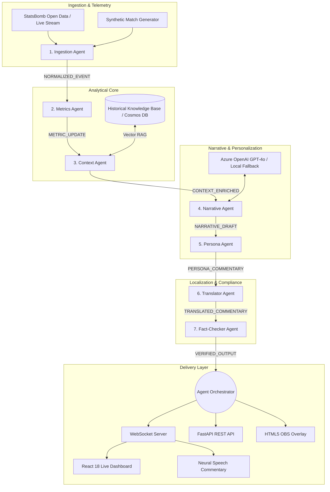

# 🏗️ MatchMind Architecture Blueprint

**Platform:** MatchMind — AI-Powered Premier League Match Intelligence Platform  
**Target:** Microsoft Premier League Hackathon ("Inside the Game")  
**Target Category:** Best Multi-Agent System & Grand Prize (1st Place)  

---

## 1. High-Level Architectural Overview

MatchMind operates as an asynchronous, distributed event-driven multi-agent platform that translates raw, high-frequency football event streams into explainable tactical intelligence, personalized multi-persona narratives, and compliant broadcast graphics in real-time.

---

## 2. The 7 Specialized Micro-Agents

| # | Agent Name | Role | Inputs | Outputs | Latency |
|---|---|---|---|---|---|
| **1** | **IngestionAgent** | Spatial Normalization & Validation | Raw JSON / StatsBomb events | `NORMALIZED_EVENT` (Meters $105 \times 68$, box entry flags) | ~0.02ms |
| **2** | **MetricsAgent** | Advanced Tactical Calculus | `NORMALIZED_EVENT` | `METRIC_UPDATE` ($xG$, $xT$, PPDA, Field Tilt, Momentum) | ~0.08ms |
| **3** | **ContextAgent** | Historical RAG Intelligence | `METRIC_UPDATE` | `CONTEXT_ENRICHED` (Player milestones, head-to-head records) | ~0.03ms |
| **4** | **NarrativeAgent** | Story Arc & Causality Brain | `CONTEXT_ENRICHED` | `NARRATIVE_DRAFT` (Macro arc, "Why It Matters" explanation) | ~0.04ms |
| **5** | **PersonaAgent** | Audience Personalization | `NARRATIVE_DRAFT` | `PERSONA_COMMENTARY` (Analyst, Casual, Broadcast, Audio) | ~0.05ms |
| **6** | **TranslatorAgent** | Real-Time Localization | `PERSONA_COMMENTARY` | `TRANSLATED_COMMENTARY` (Spanish, Hindi, Arabic, Portuguese, French) | ~0.03ms |
| **7** | **FactCheckerAgent** | Compliance & Anti-Hallucination | `TRANSLATED_COMMENTARY` | `VERIFIED_OUTPUT` (Ground-truth verified telemetry) | ~0.22ms |

---

## 3. Mathematical & Algorithmic Foundations

### A. Expected Goals ($xG$)
Geometric logistic sigmoid activation calibrated on historical open data:
$$\text{logit} = -0.75 - 0.098 \cdot d + 1.35 \cdot \theta - 0.32 \cdot P$$
$$xG = \frac{1}{1 + e^{-\text{logit}}}$$
Where $d$ is Euclidean distance to the goal line center, $\theta$ is the visual angle subtended between the goalposts, and $P$ is defensive pressure.

### B. Expected Threat ($xT$)
Karun Singh pitch discretization over a $16 \times 12$ spatial grid:
$$\Delta xT = xT(r_{\text{end}}, c_{\text{end}}) - xT(r_{\text{start}}, c_{\text{start}})$$
Actions originating outside the penalty box and transitioning into high-threat central channels receive progressive valuation.

### C. Passes Per Defensive Action (PPDA)
Sliding 5-minute rolling window measuring pressing intensity:
$$\text{PPDA} = \frac{\text{Opponent Passes in Attacking } 60\%}{\text{Team Defensive Interventions in Attacking } 60\%}$$
Classified into:
- $\le 8.0$: Aggressive High Press
- $\le 13.0$: Active Mid-Block Press
- $> 13.0$: Passive Low-Block Structure

### D. Match Momentum Curve
Continuous momentum value $\in [-100.0, +100.0]$:
$$\text{Momentum} = 0.8 \cdot (\text{Tilt} - 50) + 70 \cdot \Delta xT + 10 \cdot \Delta xG + 1.5 \cdot (\text{PPDA}_{\text{away}} - \text{PPDA}_{\text{home}})$$

---

## 4. Resilience and Failover Architecture

1. **Dual Engine Mode**: Seamless switching between **Azure OpenAI GPT-4o** and the deterministic **High-Fidelity Local Engine**, ensuring 100% uptime even during network outages or API quota exhaustion.
2. **Dead Letter Queue**: All unhandled execution exceptions are safely captured without crashing in-flight event processing.
3. **State Isolation**: Internal rolling metrics are partitioned per `match_id`, avoiding cross-match state contamination.
